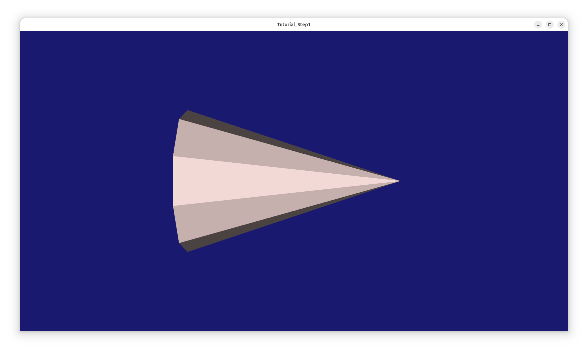
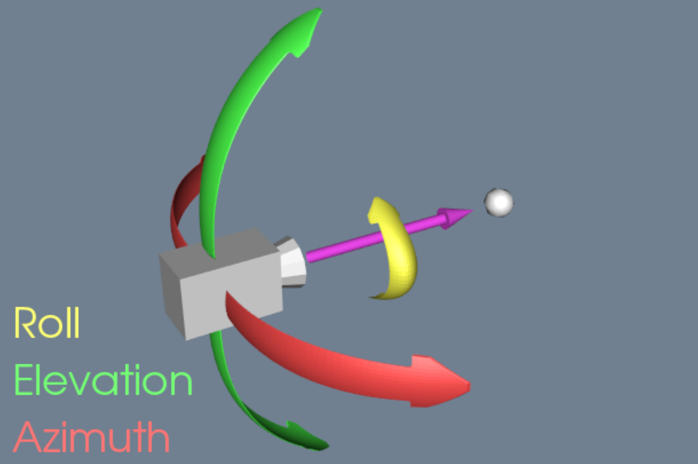

- [1. 认识 VTK 渲染管线](#1-认识-vtk-渲染管线)
  - [1.1. 使用 C++ API 渲染圆锥体](#11-使用-c-api-渲染圆锥体)
  - [1.2. 使用 Python API 渲染圆锥体](#12-使用-python-api-渲染圆锥体)
- [2. 资料链接](#2-资料链接)


## 1. 认识 VTK 渲染管线
先了解几个VTK中的常用`模板类型`：     
|模板类型| 功能 |  
|--------------------|---------------------|   
|vtkNew            | VTK封装的智能指针。|     
|vtkNamedColors    | 封装了VTK内置的命名颜色集合，提供RGB颜色定义，常用于可视化场景中的颜色配置。|  
|vtkConeSource     | VTK可视化管线中的一个节点，它负责产生数据（输出类型为 vtkPolyData），供后续过滤器处理。|  
|vtkPolyDataMapper | 该类将 vtkPolyData 数据转换为几何图元，方便使用底层接口渲染，如 OpenGL。<br> 需要将 vtkPolyData 的 output 连接到 vtkPolyDataMapper 的 input|    
|vtkActor          | “`演员`” 是场景中所有`可渲染对象`的基类。<br> 负责：绑定几何数据（通过 SetMapper）、管理外观属性（颜色、光照、纹理等）、应用变换矩阵（平移、旋转、缩放）|            
|vtkRenderer       | VTK 渲染器，管理舞台（渲染场景）中的渲染操作，一个渲染器可以管理多个 Actor。|    
|vtkRenderWindow   | 渲染窗口是最终的输出载体，负责： <br>  管理一个或多个渲染器（通过 AddRenderer()）、 <br>  控制窗口大小和位置、   <br>   处理操作系统级的窗口事件、 <br>  触发实际的渲染操作。|  
|vtkCamera         | 可以理解为观察着的眼睛|  


### 1.1. 使用 C++ API 渲染圆锥体
**我们看一个简单的Demo** ：     
   

```cpp
#include <vtkActor.h>
#include <vtkCamera.h>
#include <vtkConeSource.h>
#include <vtkNamedColors.h>
#include <vtkNew.h>
#include <vtkPolyDataMapper.h>
#include <vtkProperty.h>
#include <vtkRenderWindow.h>
#include <vtkRenderer.h>


int main(int, char*[])
{
    // 颜色对象。      
    vtkNew<vtkNamedColors> colors;

    // 创建了一个圆锥体数据源并设置其参数。  
    vtkNew<vtkConeSource> cone;  
    cone->SetHeight(3.0);        // 设置圆锥高度为3.0单位
    cone->SetRadius(1.0);        // 设置底面半径为1.0单位
    cone->SetResolution(10);     // 设置圆锥侧面由10个分段构成，应该叫做棱锥

    // 将 vtkPolyData 的 output 连接到 vtkPolyDataMapper 的 input。 
    vtkNew<vtkPolyDataMapper> coneMapper;
    coneMapper->SetInputConnection(cone->GetOutputPort());

    // 创建并配置一个VTK演员（vtkActor）对象。   
    vtkNew<vtkActor> coneActor;
    coneActor->SetMapper(coneMapper);                                              // 绑定几何数据
    coneActor->GetProperty()->SetColor(colors->GetColor3d("MistyRose").GetData()); // 管理外观属性

    // 创建并配置一个VTK渲染器。   
    vtkNew<vtkRenderer> ren1;     // vtkRenderer 实例，用于管理场景中的渲染操作
    ren1->AddActor(coneActor);    // 将之前创建的演员（coneActor）添加到渲染器中，一个渲染器可以管理多个演员
    ren1->SetBackground(colors->GetColor3d("MidnightBlue").GetData()); // 设置渲染器的背景颜色，

    // 创建并配置VTK渲染窗口
    vtkNew<vtkRenderWindow> renWin;    // 最终显示渲染结果的窗口
    renWin->AddRenderer(ren1);         // 将之前创建的渲染器添加到窗口，一个窗口可包含多个渲染器
    renWin->SetSize(300, 300);
    renWin->SetWindowName("Tutorial_Step1");

    // 锥体的连续旋转动画
    for (int i = 0; i < 360; ++i)
    {
      // 触发渲染窗口的渲染操作
      renWin->Render();                    

      // GetActiveCamera() 获取当前渲染器的主相机   
      // Azimuth(1) 表示绕观察点水平旋转 1 度 
      ren1->GetActiveCamera()->Azimuth(1); 
    }

    return EXIT_SUCCESS;
}
```
这里就讲一下，相机视角的旋转问题：      
`vtkCamera* GetActiveCamera();`获取当前渲染器的活动相机。   
`void Azimuth(viskores::Float32 angleDegrees);`旋转相机水平时视角。   
既然有`水平视角`，那么就有`垂直视角`和`旋转`，他们的关系如图：    
   

### 1.2. 使用 Python API 渲染圆锥体
和C++过程一样。   

```py
import vtkmodules.vtkInteractionStyle  # 提供交互样式支持（如鼠标/键盘控制）
import vtkmodules.vtkRenderingOpenGL2  # 基于OpenGL 2.0的渲染引擎模块，必须导入的

from vtkmodules.vtkCommonColor import vtkNamedColors
from vtkmodules.vtkFiltersSources import vtkConeSource
from vtkmodules.vtkRenderingCore import (
    vtkActor,
    vtkPolyDataMapper,
    vtkRenderWindow,
    vtkRenderer
)

def main(argv):

    colors = vtkNamedColors()

    cone = vtkConeSource()
    cone.SetHeight(3.0)
    cone.SetRadius(1.0)
    cone.SetResolution(10)

    coneMapper = vtkPolyDataMapper()
    coneMapper.SetInputConnection(cone.GetOutputPort())

    coneActor = vtkActor()
    coneActor.SetMapper(coneMapper)
    coneActor.GetProperty().SetColor(colors.GetColor3d('MistyRose'))

    ren1 = vtkRenderer()
    ren1.AddActor(coneActor)
    ren1.SetBackground(colors.GetColor3d('MidnightBlue'))

    renWin = vtkRenderWindow()
    renWin.AddRenderer(ren1)
    renWin.SetSize(300, 300)
    renWin.SetWindowName('Tutorial_Step1')

    for i in range(0, 360):
        renWin.Render()
        ren1.GetActiveCamera().Azimuth(1)

if __name__ == '__main__':
    import sys

    main(sys.argv)
```

## 2. 资料链接
[VTK官方Demo](https://examples.vtk.org/site/)，循序渐进的示例程序。    
[Python Demo](https://examples.vtk.org/site/Python/#tutorial)，Python 示例程序。         
[VTK接口文档](https://vtk-951.netlify.app/)，类型以及函数接口文档。    
[类文档](https://examples.vtk.org/site/Cxx/Coverage/CxxVTKClassesUsed/)，带有示例的类文档。    

官方网站的下载页面有 6 下载文件：   
```bash
VTK-9.5.1.tar.gz                # 核心源码包

# 测试数据包，解压后就是 `VTK-x.x.x/.ExternalData/`  
VTKData-9.5.1.tar.gz            # 测试数据索引包， 告诉 CMake ExternalData 模块去哪里下载真正的测试输入 & 基准图像。
VTKDataFiles-9.5.1.tar.gz       # 和上面一样，但是包含了完整测试数据集，不用在线下载了。     

# 离线 HTML 文档包
vtkDocHtml-9.5.1.tar.gz         

# 这两个好像是旧版的测试数据包，不需要了
VTKLargeData-9.5.1.tar.gz   
VTKLargeDataFiles-9.5.1.tar.gz 
```
当然官网也提供了[Python扩展包](https://vtk.org/files/release/)。   


