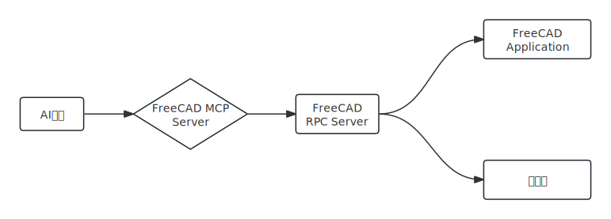

&emsp;&emsp;今天介绍一个开源项目——[FreeCAD-MCP](https://github.com/neka-nat/freecad-mcp)，这是一个集成了MCP的FreeCAD控制方案，将AI助手与3D建模软件结合起来，用户可以通过描述需求控制FreeCAD生成3D模型，还支持从2D图纸生成3D模型，支持迭代设计细化，也就是可以请求对现有设计进行修改并实时查看更改。   

该项目的整体架构如下：  
  

该系统由两个主要部分组成： FreeCAD RPC Server 和 FreeCAD MCP Server。   

- [1. **FreeCAD RPC Server**](#1-freecad-rpc-server)
- [2. **FreeCAD MCP Server**](#2-freecad-mcp-server)
- [3. **核心功能**](#3-核心功能)


## 1. **FreeCAD RPC Server**   
这是一个基于XML-RPC协议的服务器，作为插件安装在 FreeCAD 中，它的功能是通过 XML-RPC 接口公开 FreeCAD 控制功能，零件库的访问功能给MCP服务器，并且处理处理来自MCP服务器的请求。   
```python
# InitGui.py  FreeCAD插件初始化文件  
class FreeCADMCPAddonWorkbench(Workbench):
    MenuText = "MCP Addon"
    ToolTip = "Addon for MCP Communication"

    # ...
    # ...

Gui.addWorkbench(FreeCADMCPAddonWorkbench())
```

## 2. **FreeCAD MCP Server**    
这是一个Python包，实现模型上下文协议，为模型提供访问FreeCAD功能的通道。FreeCAD-MCP Server 通过XML-RPC连接到FreeCAD RPC服务器，将Claude的请求翻译成FreeCAD可以理解的命令
，最后将结果作为文本和可选图像返回给模型。     

FreeCAD MCP Server 向AI助手暴露的核心 FreeCAD 工具如下：     
|       工具     |      功能      |
|---------------|----------------|
| = 文档管理 = |  ------ |
|create_document|在FreeCAD中创建新文档|
|get_objects|获取文档中的所有对象|
| = 对象管理 = | ------ |
|create_object|在FreeCAD中创建一个新对象|
|edit_object|在FreeCAD中编辑对象|
|delete_object|在FreeCAD中删除对象|
|get_object|在文档中获取对象|
| = 零件库 = | ------ |
|insert_part_from_library|从零件库中插入零件|
|get_parts_list|获取零件库中的零件列表|
| = 可视化 = | ------ |  
|get_view|获取活动视图的屏幕截图|
| = 脚本 = | ------ |
|execute_code|在FreeCAD中执行Python代码|  


## 3. **核心功能**   
这个控制系统提供了 4 项核心功能：  

- 通过对话设计组件，   用户可以描述他们想要创建的零件，Claude会生成必要的FreeCAD操作。   
- 从2D图纸创建3D模型， Claude可以解释2D图纸并创建相应的3D模型。    
- 迭代设计细化， 用户可以请求对现有设计进行修改并实时查看更改。   
- 访问零件库， 用户可以要求Claude从FreeCAD零件库中插入标准件。   


